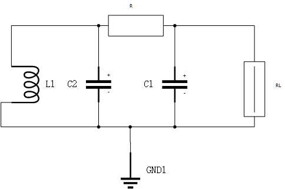

# chua电路
## 1.方程建立

在 Chua 电路中，状态变量包括两个电容的电压 $U_1, U_2$ 和电感的电流 $I_3$。时间为$T$。由KVL和KCL可以列出电路的原始方程组。

$$
\left\{
\begin{aligned}
C_1 \frac{dU_1}{dT} &= \frac{U_2 - U_1}{R} - g(U_1), \\
C_2 \frac{dU_2}{dT} &= \frac{U_1 - U_2}{R} + I_3, \\
L \frac{dI_3}{dT} &= -U_2.
\end{aligned}
\right.
$$

其中，非线性电导 $g(U_1)$ 表示 Chua 二极管的特性，其形式为分段线性函数：

$$
g(U_1) = G_b U_1 + \frac{1}{2} (G_a - G_b) \left( |U_1 + E_b| - |U_1 - E_b| \right).
$$

参数解释：
- $C_1, C_2$：电容值
- $L$：电感值
- $R$：电阻值
- $G_a, G_b$：非线性电导斜率
- $E_b$：非线性特性拐点电压

## 2.方程无量纲化&归一化
令$v1=\frac{V1}{E},v2=\frac{V2}{E},i3=\frac{RI_3}{E},t=\frac{T}{RC_2},\alpha=\frac{C_2}{C_1},\beta=\frac{C_2R^2}{L}$
则可得去量钢化和归一化的方程组为(便于方程求解)：
$$
\left\{
\begin{aligned}
\frac{du_1}{dt} &= \alpha (u_2 - u_1 - f(u_1)), \\
\frac{du_2}{dt} &= u_1 - u_2 + i_3, \\
\frac{di_3}{dt} &= -\beta u_2.
\end{aligned}
\right.
$$
## 3.解方程组
## 4.结果可视化
在chua_gui.py中调节$\alpha,\beta$等参数可以观察到电路进入混沌状态的条件。
